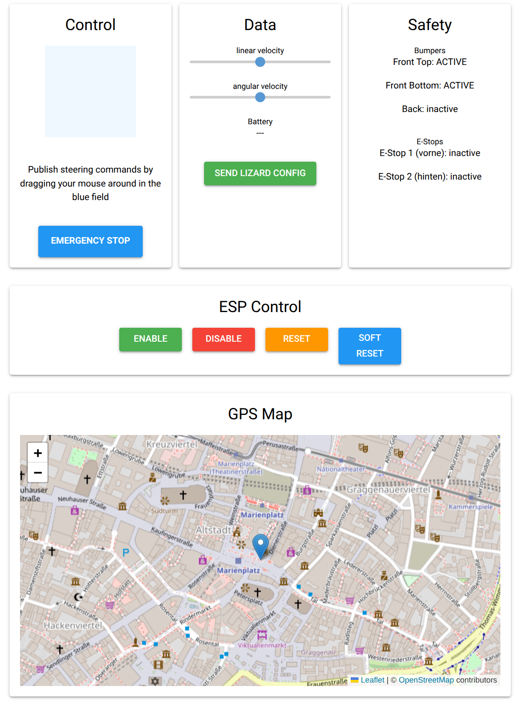

# BaseKit ROS

BaseKit ROS is a comprehensive ROS2 package that handles the communication and configuration of various field friend components:

- Communication with Lizard (ESP32) to control the Field Friend
- GNSS positioning system
- Camera systems (USB and AXIS cameras)
- Example UI to control the robot

All launch files and configuration files (except for the UI) are stored in the `basekit_launch` package.

## Components

### Basekit driver

The BaseKit driver (based on [ATB Potsdam's field_friend_driver](https://github.com/ATB-potsdam-automation/field_friend_driver)) manages the communication with the ESP32 microcontroller running [Lizard](https://lizard.dev/) firmware - a domain-specific language for defining hardware behavior on embedded systems.

The package provides:

- `config/basekit.liz`: Basic Lizard configuration for BaseKit robot
- `config/basekit.yaml`: Corresponding ROS2 driver configuration

Available ROS2 topics:

- `/cmd_vel` (geometry_msgs/Twist): Control robot movement
- `/odom` (nav_msgs/Odometry): Robot odometry data
- `/battery_state` (sensor_msgs/BatteryState): Battery status information
- `/bumper_front_top_state` (std_msgs/Bool): Front top bumper state
- `/bumper_front_bottom_state` (std_msgs/Bool): Front bottom bumper state
- `/bumper_back_state` (std_msgs/Bool): Back bumper state
- `/emergency_stop` (std_msgs/Bool): Software emergency stop control
- `/estop1_state` (std_msgs/Bool): Hardware emergency stop 1 state
- `/estop2_state` (std_msgs/Bool): Hardware emergency stop 2 state
- `/configure` (std_msgs/Empty): Trigger loading of the Lizard configuration file

### Camera System

The camera system supports both USB cameras and AXIS cameras, managed through a unified launch system in `camera_system.launch.py` that handles USB cameras, AXIS cameras, and the Foxglove Bridge for remote viewing.

The USB camera system provides video streaming through ROS2 topics using the `usb_cam` ROS2 package. Camera parameters can be configured through `config/camera.yaml`.

The AXIS camera system integrates with the [ROS2 AXIS camera driver](https://github.com/ros-drivers/axis_camera/tree/humble-devel) to support multiple IP cameras with individual streams. Each camera can be configured through `config/axis_camera.yaml`, with credentials managed through `config/secrets.yaml` (template provided in `config/secrets.yaml.template`). The cameras' authentication mode (basic or digest) might need to be configured - see [AXIS Camera Authentication](#axis-camera-authentication) section for details.

The visualization system integrates with [Foxglove Studio](https://foxglove.dev/) for remote camera viewing, supporting compressed image transport. The Foxglove Bridge is accessible via WebSocket connection on port 8765.

### GNSS System

The GNSS system uses the [Septentrio GNSS driver](https://github.com/septentrio-gnss/septentrio_gnss_driver) with the default `config/gnss.yaml` configuration. Available topics:

- `/pvtgeodetic`: Position, velocity, and time in geodetic coordinates
- `/poscovgeodetic`: Position covariance in geodetic coordinates
- `/velcovgeodetic`: Velocity covariance in geodetic coordinates
- `/atteuler`: Attitude in Euler angles
- `/attcoveuler`: Attitude covariance
- `/gpsfix`: Detailed GPS fix information including satellites and quality
- `/aimplusstatus`: AIM+ status information

### Basekit UI

The example UI provides a robot control interface built with NiceGUI, featuring a joystick control similar to turtlesim. It gives you access to and visualization of all topics made available by the BaseKit driver, including:

- Robot movement control through a joystick interface
- Real-time visualization of GNSS data
- Monitoring of safety systems (bumpers, emergency stops)
- Software emergency stop control

The interface is accessible through a web browser at `http://<ROBOT-IP>:80` when the robot is running.

<div align="center">
  
  <div style="font-size: 0.95em; color: #555; margin-top: 0.5em;">
    Example UI: Control, data, safety, and GPS map in one interface.
  </div>
</div>

## Docker Setup

### Using Docker Compose

1. Build and run the container:

```bash
cd docker
docker-compose up --build
```

2. Run in detached mode:

```bash
docker-compose up -d
```

3. Attach to running container:

```bash
docker-compose exec basekit bash
```

4. Stop containers:

```bash
docker-compose down
```

The Docker setup includes:

- All necessary ROS2 packages
- Lizard communication tools
- Camera drivers
- GNSS drivers

## Connect to UI

To access the user interface (UI), follow these steps:

1. **Connect to the Robot's Wi-Fi:**
   Join the robot's WLAN network.

2. **Open the UI in your browser:**
   Navigate to:

   ```
   http://<ROBOT-IP>:80
   ```

   (Replace `<ROBOT-IP>` with the actual IP address once you have it.)

## Launch Files

The system can be started using different launch files:

- `basekit.launch.py`: Launches all components
- `basekit_nocams.launch.py`: Launches all components without the cameras
- `field_friend.launch.py`: Launches only Field Friend driver
- `camera_system.launch.py`: Launches complete camera system (USB + AXIS) and Foxglove Bridge
- `usb_camera.launch.py`: Launches USB camera only
- `axis_cameras.launch.py`: Launches AXIS cameras only
- `gnss.launch.py`: Launches GNSS system
- `ui.launch.py`: Launches the example UI node

To launch the complete system:

```bash
ros2 launch basekit_launch basekit.launch.py
```

## AXIS Camera Authentication

The AXIS cameras can be configured to use either digest or basic authentication. To check and configure the authentication mode:

1. Check current authentication settings:

```bash
curl --digest -u root:pw "http://192.168.42.3/axis-cgi/admin/param.cgi?action=list&group=Network.HTTP" | cat
```

2. Switch authentication mode (e.g., from digest to basic):

```bash
curl --digest -u root:pw "http://192.168.42.3/axis-cgi/admin/param.cgi?action=update&Network.HTTP.AuthenticationPolicy=basic" | cat
```

Replace `root:pw` with your camera's credentials and `192.168.42.3` with your camera's IP address. The authentication mode can be set to either `basic` or `digest`. Note that you should always use the `--digest` flag in these commands even when switching to basic auth, as the camera's current setting might be using digest authentication.

## Quickstart guide

### 1. Clone the Repository

```bash
git clone https://github.com/zauberzeug/basekit_ros.git
cd basekit_ros
```

### 2. Validate Configuration

Before building, check and adjust if needed:

1. **ROS2 Configuration** (`basekit_launch/config/basekit.yaml`):

   - Verify `serial_port` matches your setup (default: "/dev/ttyTHS0")
   - Check `flash_parameters` for your hardware (default: "-j orin --nand")

2. **Lizard Configuration** (`basekit_launch/config/basekit.liz`):
   - Verify motor configuration matches your hardware
   - Check pin assignments for bumpers and emergency stops
   - Adjust any other hardware-specific settings

### 3. Build with Docker

```bash
./docker.sh u
```

### 4. Send Lizard Configuration

Once the system is running:

- Use the "Send Lizard Config" button in the UI
- Or use the `/configure` topic in ROS2

### 5. Ready to Go

Check the UI at `http://<ROBOT-IP>:80` to control and monitor your robot.

## Future features

This repository is still work in progress. Please feel free to contribute or reach out to us, if you need any unimplemented feature.

- Complete tf2 frames
- Handle camera calibrations
- Robot visualization
